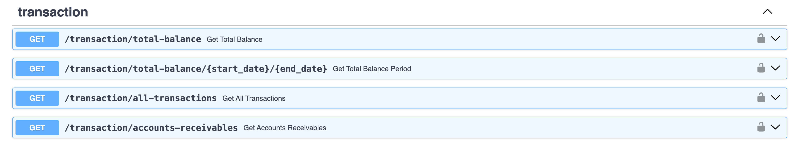
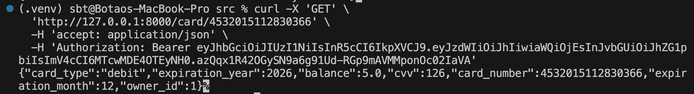

# opp-api

## PM1
* Please see design-documents folder

## PM2
* For REST APIs, please see src/routers, we build 11 public-facing APIs for card/payment/transaction model
* For database, we use Sqlite3 for our project. More details are included in src/db/database.py
* For WSGI, we use Univorn as shown below:

## PM3
* The API call using curl is successful as shown below:
  
* All tests for ReST APIs are included in tests folder