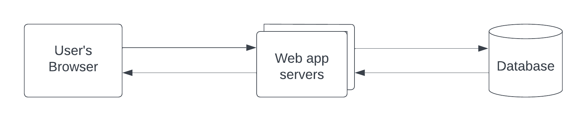
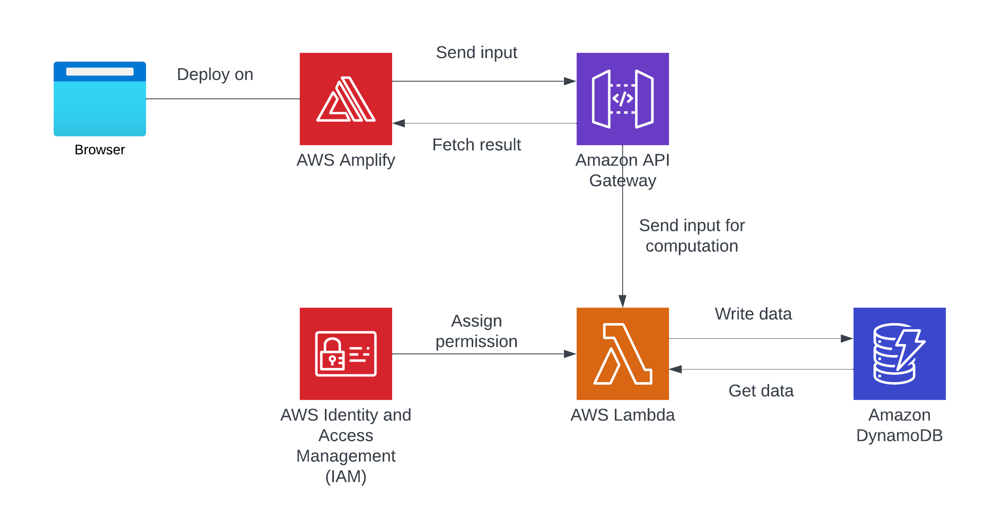
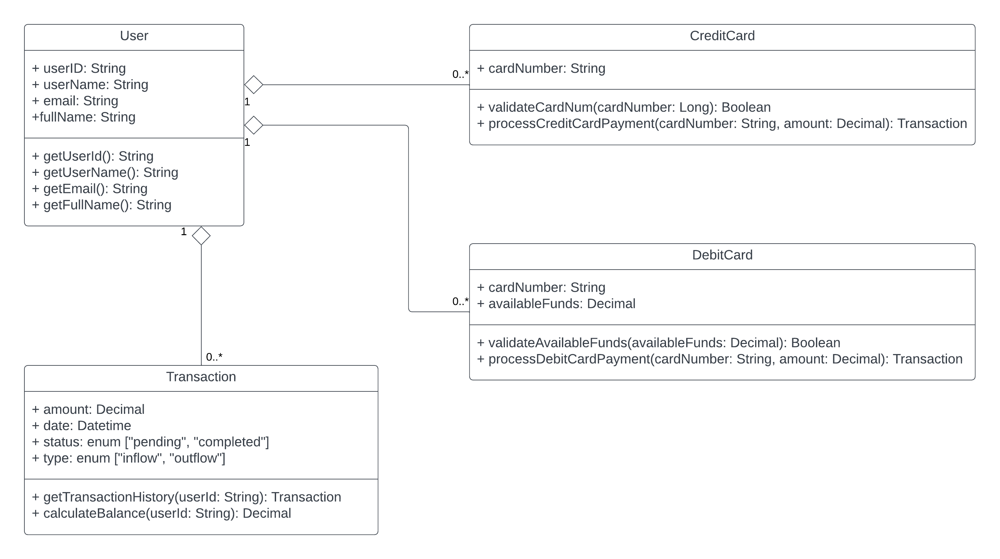

**<big>Design document for TeamHHS</big>**  

**High Level Design**  

For overall architecture, we prioritize simplicity in our application, focusing on three key components:  
1. Front-End Interface: This is where users interact with our application, providing input and receiving output.  
2. Backend Server: Our backend server handles the APIs, orchestrating data processing and interaction with the database.  
3. Database: We store all data in our database, ensuring efficient data management.  

When users perform actions on the front-end interface, their input is seamlessly transferred to the backend server for computation. This computation leads to interactions with the database, and once completed, the results are promptly sent back to the front-end for user visibility and interaction.  

Diagram for local environment:
  

We will leverage AWS for our cloud deployment. Here's our streamlined approach:  
1. Amplify for Web Hosting: We'll begin by hosting our web pages on AWS Amplify. This platform simplifies web hosting and provides a seamless integration with our cloud resources.  
2. Lambda for Serverless Computation: To power our backend functionality, we'll utilize AWS Lambda. It will serve as the engine for our computations, mirroring the capabilities of a traditional backend server.  
3. Code and Testing on Lambda: The core logic and testing will primarily run on Lambda. It offers a scalable and cost-efficient environment for executing our functions.  
4. API Gateway for RESTful APIs: To create accessible endpoints for our functions, we'll use Amazon API Gateway. This service streamlines the process of designing and deploying REST APIs.  
5. DynamoDB for Data Storage: For efficient data storage, we've chosen Amazon DynamoDB. This lightweight NoSQL database will store and manage our data, making it readily available for computation and updates.  

By adopting these AWS services, we ensure a well-structured, scalable, and reliable cloud deployment for our application.  

Diagram for cloud environment:  
Reference: https://www.analyticsvidhya.com/blog/2023/07/aws-services/  
  

The deployment will be performed following below procedures:  
1. Unit Testing with pytest:  
We include unit testing as the first step in our deployment pipeline using the pytest framework, a popular Python testing tool. These tests evaluate individual functions, methods, and components for correctness, catching issues at a granular level and providing early feedback to our developers.  
2. Integration Testing:  
Moving forward, we introduce integration testing to verify that different application modules and components work seamlessly together, ensuring consistent data and information flow. Identifying integration issues early minimizes complexities in later stages.  
3. Functional Testing:  
Automated functional tests simulate user interactions, covering diverse scenarios and ensuring our application's features and functionalities work as expected, meeting user expectations efficiently.  
4. Cross-Browser and Cross-Platform Testing:  
We automate testing across various web browsers and platforms to ensure consistent application functionality, preventing browser-specific issues and ensuring a uniform user experience.  
5. Code Reviews by Our Team:  
Code reviews by our team members are an essential collaborative step in our deployment pipeline. These reviews evaluate quality, correctness, and compliance with coding standards, maintaining code maintainability and high standards.  
6. Version Control:  
Code changes are committed and merged into the version control system (e.g., Git), providing a history of changes and tracking the codebase's state.  
7. Continuous Integration/Continuous Deployment (CI/CD):  
Automated CI/CD pipelines streamline the deployment process, automatically deploying code changes to the production environment.  
8. Monitoring and Post-Deployment Testing:  
Continuous monitoring of the production environment and post-deployment testing ensure any issues are detected and performance is tracked.  
9. Rollback Plan:  
A rollback plan is in place to revert to the previous version in case of issues in the production environment.  
10. Documentation and Knowledge Sharing:  
Detailed documentation tracks code changes, procedures, and knowledge sharing, ensuring everyone is informed and aware of the changes and their impact.  
11. Release Notes and Communication:  
Release notes inform stakeholders and end-users of changes and improvements. Effective communication is vital for managing expectations.  

Wireframes of your UI (Heather)

Description of each of your backend modules (Shaojie)
Module1: Authentication Module
Description: The Authentication Module is responsible for user registration, login, and user authentication. It ensures that only authorized users can access the platform and perform secure transactions.

Module2: Payment Processing Module
The Payment Processing Module handles the processing of credit and debit card payments. It ensures secure and efficient payment transactions for users.

Module3: Transaction Management Module
The Transaction Management Module is responsible for recording and managing transaction history, calculating balances, and providing users with access to their transaction data.

**Low Level Design**  

We aim to maintain four entities for the database: user, creditCards, debitCards, and transaction. The relationship of these four entities is:  
  

Sequence Diagram of each ReST API (Shaojie)
Payment Processing - "/api/process-payment" Endpoint:

Balance Calculation - "/api/calculate-balance" Endpoint:

Transaction History - "/api/get-transaction-history" Endpoint:

User Signup - "/api/signup" Endpoint:

User Signin - “/api/signin” Endpoint:

ReST API design (Heather): please see the separate file in the design-documents folder.

Description of how each backend module performs its job. Submit a module or class diagram of its attributes and methods (Shaojie)
1. Module: Authentication Module
Methods:

registerUser(username: String, password: String, email: String, fullName: String): User
Description: Registers a new user with the provided information.
Parameters:username (String): The username of the user.
password (String): The user's password.
email (String): The user's email address.
fullName (String): The user's full name.
Returns:
User: The newly registered user object.
login(username: String, password: String): User
Description: Authenticates a user based on the provided username and password.
Parameters:username (String): The username of the user.
password (String): The user's password.
Returns:
User: The authenticated user object.
logout(userId: String): void
Description: Logs out a user by invalidating their session or token.
Parameters:userId (String): The ID of the user to log out.
getUserById(userId: String): User
Description: Retrieves user information based on the user's ID.
Parameters:userId (String): The ID of the user.
Returns:User: User information for the specified user.

2. Module: Payment Processing Module
Methods:

processCreditCardPayment(cardNumber: String, amount: Decimal): Transaction
Description: Processes a credit card payment for a specified amount.
Parameters:cardNumber (String): The credit card number.
amount (Decimal): The payment amount.
Returns:
Transaction: The transaction details.
processDebitCardPayment(cardNumber: String, amount: Decimal): Transaction
Description: Processes a debit card payment for a specified amount, validating available funds.
Parameters:
cardNumber (String): The debit card number.
amount (Decimal): The payment amount.
Returns:
Transaction: The transaction details.

3. Module:Transaction Management Module
Methods:

getTransactionHistory(userId: String): List<Transaction>
Description: Retrieves a list of transactions for a specified user.
Parameters:
userId (String): The ID of the user.
Returns:
List<Transaction>: A list of transaction records.
calculateBalance(userId: String): Decimal
Description: Calculates the current total balance of fully processed funds for a user.
Parameters:userId (String): The ID of the user.
Returns:Decimal: The total balance.

Class Diagram:

